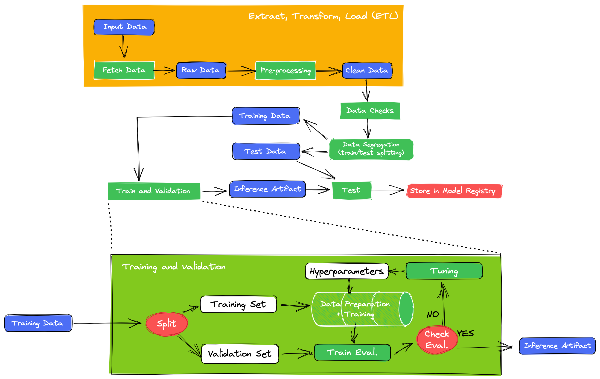

# phishing-detection

This project is a machine learning experiment to detect phishing websites by url.
The dataset is available [here](https://data.mendeley.com/datasets/c2gw7fy2j4/3).

## Setup up the environment

This project is developed using Anaconda for manage the environment. To setup your environment follow the steps:

    conda env create --file environment.yml
    conda activate phishing-detection
    pip install -r requirements.txt

To exit the envoriment:

    conda deactivate

## From Data to Model

The model's creation is developed according to the workflow model presented by Ivanovitch.

Each task is developed in a Jupyter Notebook file. The files are numbered according to the workflouw sequence. They're avaliable at the directory source/creating_model.